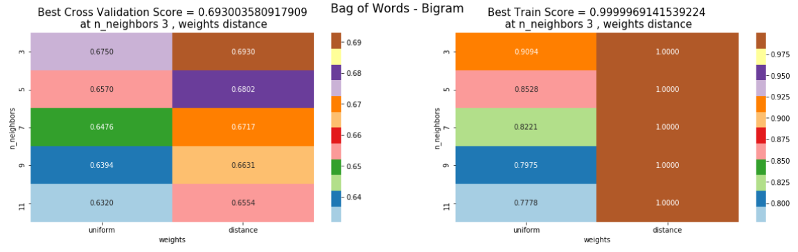

# classical-Machine-Learning
This repo contains the code implementation for various classification, clustering and novice Deep learning methods. I have used [Amazon Fine Food Reviews](https://www.kaggle.com/snap/amazon-fine-food-reviews) dataset for implementing.

Performed Various preprocessing Techniques
1. Bag of Words
2. Term Frequency and Inverse document Frequency
3. Word2vec

Various Analysis
1. Precision
2. Recall
3. Confusion Matrix
4. ROC & AUC curves

## Stochastic Gradient Descent
Implemented and compared sklearn Linear Regressor and my own custom linear regressor.

## Decision Tree
Implement GridSearch Hyperparameter using scikit-learn to find the best hyperparameter

